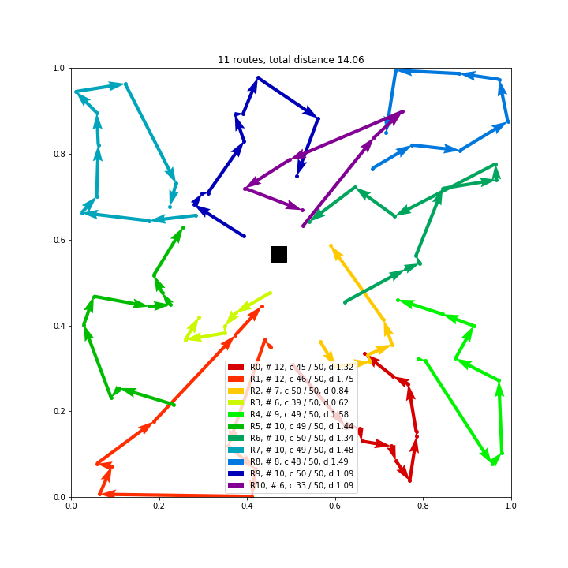

# Attention Solves Your TSP, Approximately

Attention based model for learning to solve the Travelling Salesman Problem (TSP) and the Vehicle Routing Problem (VRP). Training with REINFORCE with greedy rollout baseline.

## Paper
Please see our paper [Attention Solves Your TSP, Approximately](https://arxiv.org/abs/1803.08475). 

## Dependencies

* Python>=3.5
* NumPy
* SciPy
* [PyTorch](http://pytorch.org/)=0.3
* tqdm
* [tensorboard_logger](https://github.com/TeamHG-Memex/tensorboard_logger)
* Matplotlib (optional, only for plotting)

## Usage

For training TSP instances with 20 nodes and using rollout as REINFORCE baseline:
```bash
python run.py --graph_size 20 --baseline rollout --run_name 'tsp20_rollout'
```

By default, training will happen on all available GPUs. To disable CUDA at all, add the flag `--no_cuda`. 
Set the environment variable `CUDA_VISIBLE_DEVICES` to only use specific GPUs:
```bash
CUDA_VISIBLE_DEVICES=2,3 python run.py 
```
Note that using multiple GPUs has limited efficiency for small problem sizes (up to 50 nodes).

To evaluate a model, use the `--load_path` option to specify the model to load and add the `--eval_only` option, for example:
```bash
python run.py --graph_size 20 --eval_only --load_path 'outputs/tsp_20/tsp20_rollout_{datetime}/epoch-0.pt'
```

To load a pretrained model:
```bash
CUDA_VISIBLE_DEVICES=0 python run.py --graph_size 100 --eval_only --load_path pretrained/tsp_100/epoch-99.pt
```
Note that the results may differ slightly from the results reported in the paper, as a different test set was used than the validation set (which depends on the random seed).

For other options and help:
```bash
python run.py -h
```

## Example CVRP solution
See `plot_vrp.ipynb` for an example of loading a pretrained model and plotting the result for Capacitated VRP with 100 nodes.



## Acknowledgements
Thanks to [pemami4911/neural-combinatorial-rl-pytorch](https://github.com/pemami4911/neural-combinatorial-rl-pytorch) for getting me started with the code for the Pointer Network.